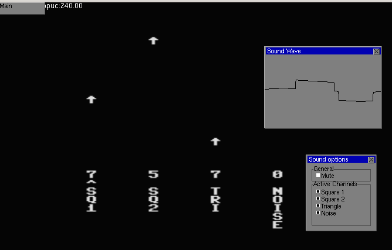

# NES Audio Synthesizer (from WAV)

Quick tickle-the-itch project on taking an input audio file and
generating some commands for the NES audio proccessing (APU) to
try and best reconstruct the audio.

NES audio is composed of 4 signal components: 2 square waves,
1 triangle wave, and a noise channel. I remember when writing
a NES emulator (back in University) that I was surprised at how
the Super Mario Brothers song had used the noise channel as
percussion.

The square and triangle waveforms have other features (
like frequency sweeping, and envelope decay) that I didn't
try to use here.

Fourier analysis of the sequence is done in chunks (e.g.,
block sizes of 1024, 2048, 4096 samples), and the best parameters
(frequency, duty-cycle type, volume) are selected for each of the
4 waveforms.

There is a simple c-code driver ([rom/audio_main.c](rom/audio_main.c))
that is used to feed the data to the NES APU. It has a simple
equalizier.

Interface:



Restricting to square channels:
[square 2](img/square2.png), [square 1&2](img/square12.png).
In the interface, you can use left/right to highlight channel
and down/up to mute/unmute.


Requirements:

* Octave (for doing the analysis)
* c65 (a c-compiler to generate NES files)
* A 44.1khz .wav file to sample from (use FFmpeg to generate a wav file if you don't have one)
* A NES emulator to play your ROMs

Some video examples:
* [Californication](https://ww.youtube.com/watch?v=8VSbv4xZQH0)
* [Elephant Gun](https://www.youtube.com/watch?v=IWSk03ZonaQ)
* [Hey Jude](https://www.youtube.com/watch?v=Q7vPBbWsyzs)

## Running the analysis

Run the following command to generate a playable NES ROM from your input wav:

```
analyze_wav_file('wav/my_input.wav', 'my_output');
```

The output will be in the `rom` folder:

* my_output_tri0_2048.rom: Give square wave's first priority, using block size of 2048
* my_output_tri0_4096.rom: Give square wave's first priority, using block size of 4096
* my_output_tri1_2048.rom: Give triangle wave's first priority, using block size of 2048
* my_output_tri1_4096.rom: Give triangle wave's first priority, using block size of 4096

Using a smaller block size increases representation ability, but also leads to more audio
popping due to changing the parameters more frequently.

## Other arguments ("other_args")

The low and high frequencies caps can be specified. Cappign the upper frequency can get
rid of some of the vocals (which sometimes cause confusion in the frequency selection).

`attenuate_sigma`: controls the range of frequencies attenuated after choosing a frequency
for a single channel (making this small will cause square and triangle waves to choose
similar frequencies)


`clear_all_freq`: When 1, similar frequencies chosen in square or triangle waves are not
allowed in the other wave types (triangle or wave).

## Examples

There are a few examples (.c, and .rom) in [rom](rom) directory:

* [radiohead_tri1_4096.rom](rom/radiohead_tri1_4096.rom): Good example of noise used as percussion.
* [californication_tri0_4096.rom](rom/californication_tri0_4096.rom): Giving square waves higher priority.
* [hey_jude_tri0_2048.rom](rom/hey_jude_tri0_2048.rom): Using a smaller block size.